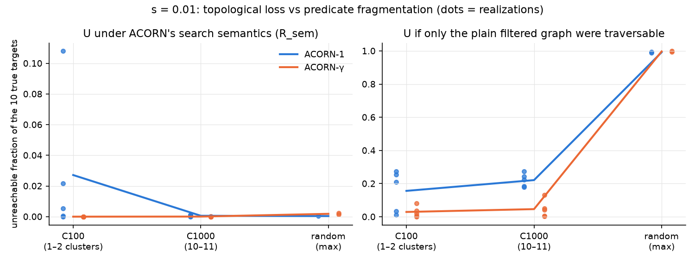

# Topological vs Navigational Recall Loss in Filtered ANN Search

## Research question

At matched global selectivity, how much of filtered approximate-nearest-
neighbour (ANN) recall loss comes from true targets being **unreachable**
under the search's own traversal rules, and how much from targets that are
**reachable but not found** within the budget? How does this balance change
with **predicate fragmentation**, and which part do ACORN's two repair
mechanisms (ACORN-1's search-time 2-hop expansion, ACORN-γ's build-time
densification) affect?

For every query the recall loss is split exactly:

    1 − Recall@10 = U + N(b)
    U    = |T \ Reach| / k                  (topological: unreachable targets)
    N(b) = |(T ∩ Reach) \ Found(b)| / k     (navigational: reachable, missed)

T = exact filtered top-10 (brute-force ground truth); Reach = nodes reachable
from the query's actual level-0 starting node under ACORN's traversal rules
with unlimited budget (`docs/structural_design.md` §3). Methods: pre-filter
(PRE), post-filter (POST), ACORN-1 and ACORN-γ.

## Main result (SIFT1M, s = 0.01)

1. **Under ACORN's own semantics, recall loss is overwhelmingly
   navigational.** Fragmented predicates shatter the plain filtered graph (up
   to 99 % of targets unreachable), but ACORN's 2-hop traversal reconnects
   almost all of it: residual U ≤ 0.2 % on average, except ACORN-1 on
   island-like predicates (2.7 %, up to 10.8 % in one realization).
2. **U is the recall ceiling.** It does not shrink with budget and is
   89–91 % of the remaining loss at the largest budget.
3. **ACORN-1 and ACORN-γ fail on opposite predicate structures.** ACORN-γ's
   dense graph bridges separate predicate islands (U ≈ 0 for C ≤ 1000) but
   its Mβ-limited 2-hop expansion leaves scattered predicates partly
   disconnected (U highest for random). ACORN-1's full 2-hop expansion
   handles scatter (U = 0.04 %) but cannot bridge distant islands.
4. **Baselines:** PRE has no loss at ~4× ACORN's cost (10,000 distance
   computations); POST's unfiltered graph is connected (U = 0) and all of its
   loss and cost (17K–210K distance computations) is navigational.

Figures: [U vs fragmentation](results/structural/report/figures/F1_U_vs_fragmentation.png) ·
[connectivity](results/structural/report/figures/F2_connectivity.png) ·
[L, U, N vs budget](results/structural/report/figures/F3_L_U_N_vs_budget.png) ·
[recall vs effort with PRE/POST](results/structural/report/figures/F4_recall_vs_effort_baselines.png).
Tables: [`results/structural/report/tables/`](results/structural/report/tables/).
Full results, statistics, conclusions and limitations:
**[docs/structural_results.md](docs/structural_results.md)**.

## What was actually run

All at selectivity s = 0.01, the fixed 10,000 SIFT1M queries, k = 10, the
frozen budget grid {10 … 2560} and frozen indexes (ACORN-γ: γ = 100, M = 32,
Mβ = 64; ACORN-1: γ = 1, M = 32, Mβ = 64; POST HNSW: M = 32, efc = 40):

| Run | Conditions | Methods |
|---|---|---|
| Decision experiment (main) | C = 100 × 5 realizations, C = 1000 × 5, random × 2 (C = designed k-means cluster count; random = maximal fragmentation) | ACORN-1, ACORN-γ |
| Vertical slice | C = 1000 r0, random r0 | ACORN-1, ACORN-γ |
| Baselines | the same two Phase 4 conditions | PRE, POST (Phase 4 sweeps, not rerun) |

U and connectivity were measured for all 12 decision conditions; N(b) and
recall for realization 0 of each level. Validation: the identity
1 − Recall = U + N(b) holds with 0 violations over 1.1 M per-query rows, and
every id returned by ACORN/POST is reachable under the stated semantics
(0 violations).

**The full proposed matrix was NOT run.** The design in
`docs/structural_design.md` §4 (s ∈ {0.01, 0.0625, 0.25} × C ∈ {100, 1000,
10000, random} × 5 realizations × 4 methods) was stopped by decision; C = 10,000
was generated but not analysed, and no other selectivity was studied.
Configs and scripts of the stopped runs are kept in `configs/structural/archive/`
and `scripts/archive/` and are not used for any result.

## Project history

| Phase | Content | Document |
|---|---|---|
| 0 | Build, toolchain, tests | — |
| 1 | ACORN reproduction on SIFT1M (ACORN-γ reproduced; ACORN-1 −10 %, accepted) | [phase1_acorn_repro.md](docs/phase1_acorn_repro.md) |
| 2 | PRE / POST baselines, effort accounting | [phase2_baselines.md](docs/phase2_baselines.md) |
| 3 | Synthetic filter generator + verified filtered ground truth | [phase3_filter_generator.md](docs/phase3_filter_generator.md) |
| 4 | Effort–selectivity matrix (36 sweeps, 2.28 M rows); ACORN's distance count found incomplete, `n_scanned` added | [phase4_matrix.md](docs/phase4_matrix.md) |
| 5 | Live per-query effort predictor — gate FAIL, archived negative result | [phase5_predictor.md](docs/phase5_predictor.md) |
| Structural | Topological vs navigational decomposition (this result) | [structural_design.md](docs/structural_design.md), [structural_results.md](docs/structural_results.md) |

`docs/design_doc.md` is the original plan for Phases 0–5;
`docs/structural_design.md` defines the structural study; `docs/notes.md` is
the engineering decision log.

## Repository layout

    cpp/                 C++20 core: filter generator, filtered ground truth,
                         PRE/POST, ACORN wrapper, reachability, CLIs, tests
    cpp/reachability/    ACORN traversal edge rules (R_graph, R_sem, R_cap),
                         SCC / reachability analysis
    python/analysis/     decomposition, statistics, report and figures
    configs/             YAML config for every run (phase1..5, structural/)
    scripts/             data download, phase orchestration,
                         reproduce_structural.sh
    patches/             acorn_instrumentation.patch (ACORN counters + level-0 seed)
    results/structural/  final report + small summary/provenance files (tracked);
                         all other results are regenerable and not tracked
    docs/                design and results documents

## Reproducing

Build and test:

    git submodule update --init --recursive
    git -C third_party/acorn apply ../../patches/acorn_instrumentation.patch
    scripts/download_sift1m.sh                         # SIFT1M -> data/sift/
    cmake -S . -B build -DCMAKE_BUILD_TYPE=Release -DFSE_ENABLE_CLANG_TIDY=OFF
    cmake --build build -j
    (cd build && ctest)                                # 79 C++ tests
    python3 -m venv .venv && .venv/bin/pip install -r python/requirements.txt
    .venv/bin/python -m pytest python/tests            # 49 Python tests

Regenerate the final tables and figures from the tracked summaries (no data
needed):

    .venv/bin/python python/analysis/structural_report.py

Reproduce the structural experiment end to end: build the Phase 1 ACORN-1
index and the Phase 4 indexes, ground truth and s = 0.01 sweeps with the
configs in `configs/phase1/` and `configs/phase4/` (see the phase documents),
then run

    scripts/reproduce_structural.sh

Every driver reads a YAML config, verifies index / attribute / ground-truth /
query hashes on load and records config, git state, seeds and build flags.

**Hardware and runtime** (reference VM: 16 vCPU AMD EPYC-Milan, 58 GB RAM,
CPU only): ACORN-γ (γ = 100) index build 2.6 h, POST HNSW build 10 min;
condition generation ~5–10 min per k-means realization; ACORN sweeps 10–20 min
per condition (single-threaded, run in parallel); reachability ~1 min per
condition and method at s = 0.01; analysis a few minutes. SIFT1M plus indexes
and caches need ~7 GB of disk.

## Limitations

- One dataset (SIFT1M), one selectivity (s = 0.01) for the structural result,
  k = 10, one frozen index per method (ACORN-1 uses Mβ = 64 from the Phase 1
  driver, not the paper's Mβ = M).
- C = 10,000 not analysed; random has 2 realizations; N(b) and recall come
  from realization 0; realization-level confidence intervals are wide.
- U is computed from a budget-free, truncation-free closure of ACORN's rules,
  so it is a lower bound on execution-level unreachability; truncation is
  counted as navigational (sensitivity reported).
- Effort is exact distance computations (ACORN's `n_scanned` reported
  separately); no latency or throughput claims.

## References

- L. Patel, P. Kraft, C. Guestrin, M. Zaharia. *ACORN: Performant and
  Predicate-Agnostic Search Over Vector Embeddings and Structured Data.*
  Proc. ACM Manag. Data (SIGMOD) 2(3), 2024.
  Code: https://github.com/stanford-futuredata/ACORN (pinned at c259f11).
- M. Douze, A. Guzhva, C. Deng, J. Johnson, G. Szilvasy, P.-E. Mazaré,
  M. Lomeli, L. Hosseini, H. Jégou. *The Faiss library.* arXiv:2401.08281,
  2024. J. Johnson, M. Douze, H. Jégou. *Billion-scale similarity search with
  GPUs.* IEEE Trans. Big Data 7(3), 2021.
- Y. A. Malkov, D. A. Yashunin. *Efficient and robust approximate nearest
  neighbor search using Hierarchical Navigable Small World graphs.* IEEE
  TPAMI 42(4), 2020. Code: https://github.com/nmslib/hnswlib.
- H. Jégou, M. Douze, C. Schmid. *Product quantization for nearest neighbor
  search.* IEEE TPAMI 33(1), 2011 (SIFT1M / TEXMEX corpus,
  http://corpus-texmex.irisa.fr/).

## License

MIT (see [LICENSE](LICENSE)). Submodules in `third_party/` keep their own
licenses.
